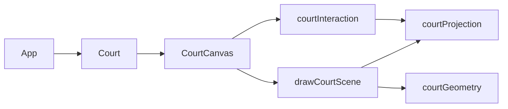

# Court and camera implementation

This document describes how the volleyball court is drawn on a **Canvas 2D** surface and how **2D / 3D view modes** and the **3D camera** work in this project.

## Overview



| File | Responsibility |
|------|----------------|
| `src/components/court/courtGeometry.ts` | Court dimensions (meters), colors, pixel sizing |
| `src/components/court/courtProjection.ts` | World → screen projection (2D and 3D) |
| `src/components/court/drawCourt.ts` | All canvas drawing (court, net, players) |
| `src/components/court/courtInteraction.ts` | Hit testing and drag → court coordinates |
| `src/components/court/CourtCanvas.vue` | Canvas element, repaint loop, pointer input |
| `src/components/court/Court.vue` | Wrapper sizing and `viewMode` prop |

There is **no WebGL / Three.js**. Everything is drawn with the 2D canvas API using a custom projection function.

---

## Coordinate systems

### World space (meters)

All geometry is defined in meters on a fixed layout:

| Axis | Meaning | Range (typical) |
|------|---------|-----------------|
| **X** | Width across the diagram | `0` … `13` (9 m court + 2 m free zone each side) |
| **Z** | Length along the court | `0` … `22` (18 m court + 2 m free zone each end) |
| **Y** | Height above the floor | `0` = floor, used for net and 3D pins |

Constants live in `COURT` (`courtGeometry.ts`):

- Playable court: **9 m × 18 m**
- Free zone (`extraSpaceM`): **4 m** total → **2 m** padding on each side (`pad = extraSpaceM / 2`)
- Attack line: **6 m** from each end line
- Net height: **2.43 m**
- Scale: **`meter`** pixels per meter (default **30** in `Court.vue`)

### Player coordinates (normalized)

Players store `coordinate: { x, y }` in **0…1** relative to the **playable court only** (not the free zone):

```ts
xM = pad + x * COURT.widthM
zM = pad + y * COURT.lengthM
```

`courtInteraction.ts` → `playerMetersOnCourt()` performs this mapping.

### Screen space (pixels)

Canvas coordinates: origin top-left, **X** right, **Y** down.

`getCourtDimensions(meter)` returns:

- `totalWidthPx = (9 + 4) * meter` → **390 px** at `meter = 30`
- `totalHeightPx = (18 + 4) * meter` → **660 px** at `meter = 30`

---

## View modes

`ViewMode` is `'2d' | '3d'`, toggled in `App.vue` and passed to `Court` → `CourtCanvas`.

### 2D mode (top-down)

Orthographic map view. `project()` maps:

```ts
screenX = origin.x + xM * meter
screenY = origin.y + zM * meter
```

No camera rotation. The full outer rectangle (court + free zone) fits the canvas.

**Players:** flat circles with role letter.

### 3D mode (perspective)

Perspective projection with an orbitable camera.

**Players:** vertical teardrop map pins (stem on floor, label in the bulb).

**Net:** poles outside sidelines, mesh between net tape heights, guy lines to pole tops (see `drawNet3d()`).

---

## Camera (3D only)

Defined in `courtProjection.ts`:

```ts
type Camera3D = {
  yaw: number   // radians, orbit around vertical (Y)
  pitch: number // radians, tilt up/down
}
```

Defaults: `DEFAULT_CAMERA_3D = { yaw: -0.55, pitch: 0.52 }`.

### Projection pipeline

1. **Center** the point on the court: `(xM - cx, yM, zM - cz)` where `cx`, `cz` are the playable court center in meters.
2. **Yaw** (rotate around Y): horizontal orbit.
3. **Pitch** (rotate around X): tilt the view.
4. **Push back** along view axis: `z2 = … + CAMERA_DISTANCE_M` (26 m).
5. **Perspective divide:**
   - `screenX = centerX + (x / depth) * focal`
   - `screenY = centerY - (y / depth) * focal`  
   (minus on Y so world-up draws upward on screen.)

Tuning constants:

| Constant | Effect |
|----------|--------|
| `CAMERA_DISTANCE_M` | Larger → less perspective exaggeration |
| `FOCAL_LENGTH_FACTOR` | Larger → narrower field of view / more zoom |
| `depth` clamp (`0.35`) | Avoids divide-by-zero behind the camera |

### Orbit controls

In `CourtCanvas.vue`, dragging **empty canvas** in 3D updates `camera.yaw` / `camera.pitch`:

- `ORBIT_YAW_SENSITIVITY = 0.008`
- `ORBIT_PITCH_SENSITIVITY = 0.008`
- Pitch clamped via `clampPitch()` in `courtInteraction.ts` (`0.2` … `1.35`)

Switching back to 2D resets the camera to `DEFAULT_CAMERA_3D`.

---

## Drawing pipeline

`CourtCanvas` calls `paint()` → `drawCourtScene()`.

### Order (3D)

1. Outside area + playable court quads (`drawOutsideAndCourt`)
2. Net: poles, mesh, tape, antennas, guy lines (`drawNet3d`)
3. Court lines: attack lines, 3 m dashes, end markers, 2D net line (`drawCourtLines`)
4. Players (`drawPlayers`)

### Order (2D)

Same without `drawNet3d`; center net line is drawn in `drawCourtLines`.

### Lines and quads

- **Quads** (`drawQuad`): outside fill, court fill + border.
- **Lines** (`drawLine`): all markings; dashed style for 3 m lines.

Outer markings use the **full outer bounds** (`totalW` × `totalH`), not only the 9×18 m court—for example:

- 3 m dashes: `0.5 m` inset from outer left/right
- End/base ticks: at `x = pad` and `x = totalW - pad`

### 3D net

- Poles at `x = pad - 0.6` and `x = totalW - (pad - 0.6)`
- Mesh spans court width at center `z = pad + 9`
- Mesh **bottom** at `netBottom = poleTop * (2/3)` (does not reach the floor)
- Mesh **top** at regulation `netHeightM` (2.43 m)

### Player markers

| Mode | Shape | World placement |
|------|--------|-----------------|
| 2D | Circle | `project(xM, zM, 0)` |
| 3D | Teardrop pin | Tip at `(xM, zM, 0)`, head at `(xM, zM, pinHeightM)` |

3D pin size: `PLAYER_MARKER_3D` in `courtGeometry.ts` (`pinHeightM`, `pinRadiusM`). Screen radius is derived from projecting a rim point so pins scale with perspective.

---

## Interaction

### Dragging players

Pointer events on the canvas (`CourtCanvas.vue`):

1. **Hit test** — `findPlayerAtPoint()` (circle in 2D, pin tip/head/stem in 3D).
2. **Drag** — `applyScreenDeltaToCourtMeters()` uses a **numerical Jacobian**: small steps in `xM` / `zM`, projected to screen, inverted to map pixel delta → meter delta on the **floor** (`y = 0`).
3. **Emit** — `playerCoordinateChange` → store saves normalized coordinates for the active formation variant.

### Dragging the camera (3D only)

If the pointer down does not hit a player, drag orbits the camera (yaw/pitch). Player drag takes priority when a marker is hit.

---

## Repainting

`CourtCanvas` repaints when:

- `players`, `viewMode`, or `meter` change
- `camera.yaw` / `camera.pitch` change (3D orbit)
- Window `resize` (resizes canvas for `devicePixelRatio`)

Each frame: `clearRect`, set transform for DPR, draw full scene.

---

## Extending / tuning

**Move camera default view:** edit `DEFAULT_CAMERA_3D` in `courtProjection.ts`.

**Zoom 3D view:** increase or decrease `FOCAL_LENGTH_FACTOR` or `CAMERA_DISTANCE_M`.

**Court size on screen:** change `meter` prop on `Court` (default 30).

**Pin size in 3D:** edit `PLAYER_MARKER_3D` in `courtGeometry.ts`.

**Colors:** edit `COURT_COLORS` in `courtGeometry.ts`.

**Add a new court line:** add geometry in meters in `drawCourtLines()`, using `project(xM, zM, yM, mode, meter, origin, camera)` — always pass **(x, z, y)** in that order.

---

## Design choices (summary)

| Choice | Reason |
|--------|--------|
| Canvas 2D vs WebGL | Simpler stack, enough for diagram + pins + one net |
| Single `project()` | One code path for court, net, and players in both modes |
| Normalized player coords | Formation data independent of `meter` / canvas size |
| Jacobian drag in 3D | Perspective is non-linear; inverse analytic unproject avoided |
| Pins only in 3D | Top-down 2D reads better as circles; 3D needs vertical markers |
